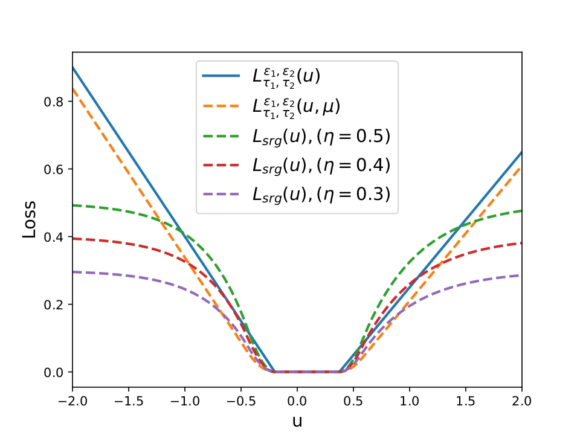

<div align="center">

## Smooth support vector machine with rescaled generalized pinball loss for classification

[**Siwakon Suppalap**](https://www.researchgate.net/profile/Siwakon-Suppalap)&nbsp;&nbsp;&nbsp;&nbsp;
**Dawrawee Makmuang**
**Vipavee Damminsed**
[**Rabian Wangkeeree**](https://www.researchgate.net/profile/Rabian-Wangkeeree)&nbsp;&nbsp;&nbsp;&nbsp;


<a href="https://link.springer.com/article/10.1007/s11227-024-06697-3">
    
</a> &ensp;


</div>



> **Abstract:** The pinball loss is favored in support vector machines for its robustness against noise. However, its unbounded nature makes it sensitive to outliers. To address this, a rescaled pinball loss offering boundedness has been introduced. Despite this improvement, the model’s performance may be limited due to restricted parameter adjustments, and its non-differentiability constrains optimization methods. Therefore, we propose a novel smooth rescaled generalized pinball loss, which is more flexible and differentiable. This loss is characterized by properties such as asymmetry, non-convexity, sparsity, boundedness, and differentiability. It is applied to support vector machines and is referred to as SRGP-SVM. Since SRGP-SVM involves a differentiable non-convex optimization problem, we employ modified Broyden–Fletcher–Goldfarb–Shanno (BFGS) methods for solving SRGP-SVM to leverage its differentiability. Experimental studies on both synthetic and real datasets demonstrate the model’s performance compared to established models.


## 📖 Citation

If you find it useful for your research or applications, please cite our paper:

```bibtex
@article{suppalap2025smooth,
  title={Smooth support vector machine with rescaled generalized pinball loss for classification},
  author={Suppalap, Siwakon and Makmuang, Dawrawee and Damminsed, Vipavee and Wangkeeree, Rabian},
  journal={The Journal of Supercomputing},
  volume={81},
  number={1},
  pages={217},
  year={2025},
  publisher={Springer}
}
```

